此篇内容是基于摸鱼小组的一个K线学习课的小结，需要时常温故知新并有序执行。
<!-- more -->
### 基础概念

成交量： 一段时间内成交的股数。成交额：则表示成交量 * 股价；
在相同的成交量的时候，股价的不一致，会导致成交额的不一致；
换手率： 成交量 / 总股本 or 流通股本
内盘： 主动卖出方的数量
外盘： 主动买入方的数量
成交量 = 外盘 + 内盘

### 量价关系

量分为： 放量，常量，缩量
价分为： 上涨，横盘，下跌
因此分为 3*3= 9种组合。

放量上涨： 主动买盘增加，意味着增量资金进场，较为乐观；

放量下跌： 主动卖盘增加，一般不健康，但是也有特殊情形，在牛市中出现单根的放量下跌， 意味着获利盘出逃， 多头依然强势时，有买入的机会。

放量横盘： 多空双方力量僵持；

缩量上涨： 主动卖盘减少，意味着投资者锁仓，在贵州茅台的拉升中，有这种情况的出现。一般有长期投资者介入才会有这种情况出现。

缩量下跌：主动买盘减少，两种情况会出现： 下跌趋势中的阴跌走势和上涨趋势后的回调，由于在回调周期，是健康的，我们可以对行情看高一线；

缩量横盘： 继续观察；

常量则沿着当前趋势继续；

量价分析其本质是为了通过分析市场背后多头和空头的态度对市场进一步地研判。

那么如何判断缩量，常量和放量呢？一般认为3%以下属于缩量， 5%以下常量， 12%放量，以上则为巨量。
一般通过换手率来判断量的程度，不同股的比例不同，不能死记硬背；

放量则表示：
1. 市场出现分歧，看空与看多的双方有非常多的争议；
2. 主力行为，庄家对个股进行对倒，并不真实，避免交易；

缩量一般认为投资者达成共识，比较真实；

### 均线系统
全称移动平均线MA， 有20世纪中期葛南维提出。我们日常听说的五日线，十日线，二十日线都属于均线系统。不同之处就在于周期不同。是趋势指标。
五日均线：从今天开始往前数5天，五天收盘价的平均值作为均线数值。

均线有三个特点：稳定性，滞后性，引力性。这个从字面可以理解。
引力性这里要引入乖离的概念， 股价与均线远近程度有关。当股价距离均线较远时，则表示乖离较大，具有回调的需求。

### 均线状态
分为多头排列，空头排列
短期均线高于长期均线，则以持股为主；当短期均线下穿长期均线，这个时候多头均线已经破坏，应该适当减仓；如果短期均线都低于长线均线，则以持币为主。
要注意的是， 由于是趋势指标， 多空相互转变时，一定是指示右侧操作，也就意味着，不可能买在最低点，也不可能卖在最高点。

特点：趋势行情中，收益较大，震荡行情收益并不好。但是趋势并不是这么好判断的。对于市场，我们最怕的并不是做错，而是没有结论。

### 均线作用
由于均线是几日的平均值，也一定程度上反映了投资者的成本。这个价格一般对于股价具有一定的支撑和压力作用。
比如股价一路上行，但是只要一往下触碰到20日均线就会停止调整继续向上。那么20日线就是股价的支撑线。很多人会找到20线和30日线作为股价的压力线和支撑线。那么，当趋势运行时，给趋势提供支撑或者压力的那根均线，就是可以被用作判断的均线。

### 交易方式
#### 金叉死叉
当短期均线上穿长期均线时买入，当短期均线下穿长期均线时卖出。
但是一旦进入震荡期，就容易频繁止损。这也是趋势指标的特点。

#### 葛南维八大买卖法

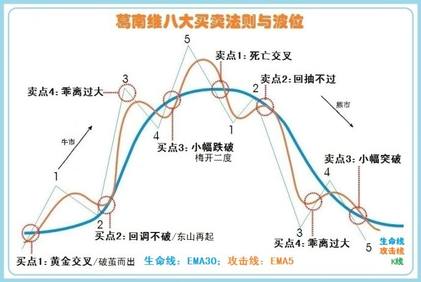

### K线形态
结合量价分析来进行观察分析

#### 单根K线

* 大阳线

分为放量大阳线和常量大阳线。
放量大阳线意味着有买入也有卖出，平均成本抬升，多头强劲。
常量大阳线意味着空头不多。
需要分析持有筹码的投资者锁仓，还是庄家持有大量筹码。
如果是后者，需要考虑庄家的筹码可能存在抛压，投资风险不小。

* 大阴线

放量：说明在大跌的同时，有不少投资者接盘。暂时安全。但是在股灾的时候也会出现连续下跌。

缩量：空头不需要卖出多少量就可以把价格砸的很低。一般出现在被市场边缘化的股票，并且股票会有持续下跌的趋势。需要无比等待。等股价逆转才开始介入。

* 上影线

属于股价冲高回落而形成的。
1. 到了短期高点，需要等待空头完全释放再考虑介入。
2. 因大盘下跌拉低股价。这种往往是错杀股，若在第二天大盘企稳，则会有不错的收益。

* 下影线

股价先向下，再向上回收。
1. 短期空头已经跌杀完毕，可以看涨。
2. 投资者心态买入和卖出不同，一般为个股的行为。单独受大盘的影响出现这个走势可能性较小。如果大盘出现比较长的下影线，那就意味着接下来的几天是比较安全的。

#### K线组合

* M顶和W底

  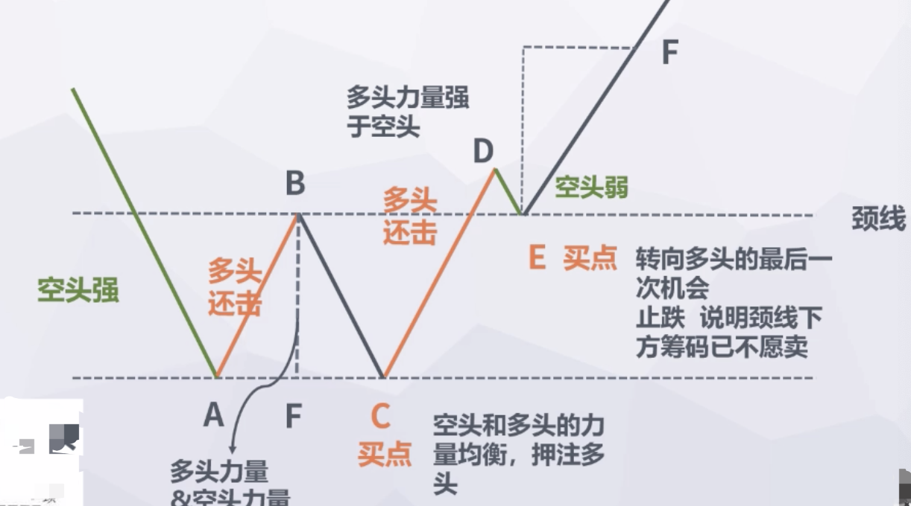 
K线组合其实就是多空力量相互抗衡。C点和E点是买点。
当股价第一次到达A点时，空头是比较强的。接下来是多头力量开始反击，A点直至B点，BF的高度就是多头的力量。接下来股价从B点直至C点，BF的长度也意味着空头的力量，此时发现空头力量开始衰竭，甚至在C点开始反转，那么C点则为多空头力量均衡点，此时可以押注多头。
C点之后，直到D点，发现CD长于BC，说明多头强于空头。所以我们等待空头的再一次释放。
E点就是我们的最后机会。当到达颈线位置时止跌，说明颈线下方的筹码已经不愿意卖了。M顶也是一样的分析方法。

* 头肩顶和头肩底

  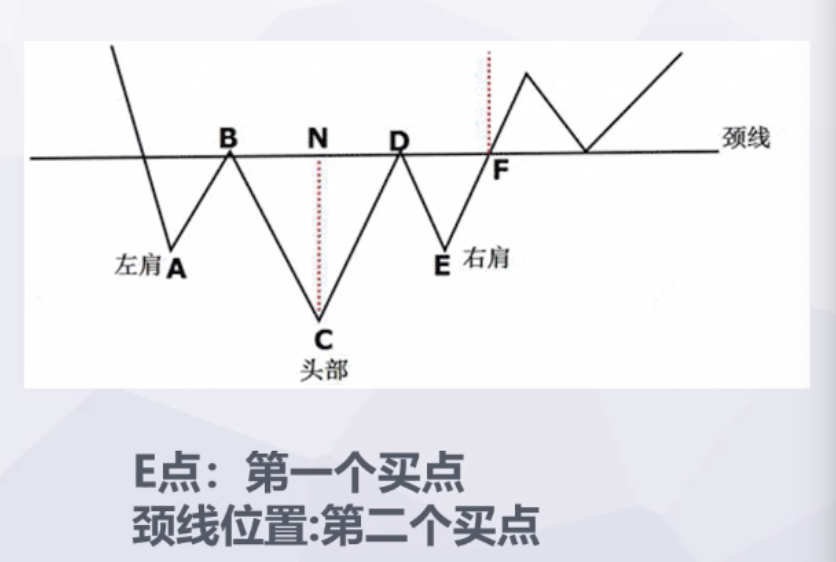 
我们用多空分析的方法来进行同样的分析，就可以发现，E点是第一个买点，颈线则为第二个买点。

其实和数学题一样，明白道理之后需要大量的实践来进行验证。

### K线形态

#### 趋势线
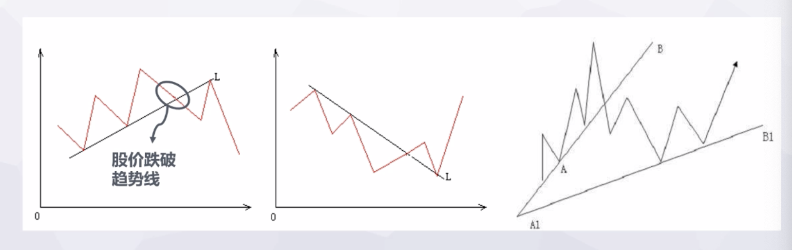 
连上股价的高点和低点，我们就得到了趋势线。
当股价下跌或上涨击破趋势线则认为趋势可能被破坏，那么需要等待一个反抽的机会再做交易。
并不是趋势一被击破，就认为趋势被破坏了，我们还要观察原趋势的能量是否能把股价拉回到趋势中。
如果可以拉回，就需要改变趋势线的画法，将起始点与最新的低点或者高点连接，从而形成新的一条趋势线。
如果不能拉回，则有可能股价反转。
#### 三角形
把上涨趋势和下跌趋势都画出来之后，一般会得到一个三角形，股价会在这个三角形内运动。
当股价突破三角形的一条边时，则要看股价是否会波动回三角形中。
如果回到三角形里，那还是继续在三角形内部波动。
如果不会，这个三角形已经收敛完毕，股价将会朝着另一个方向再次趋势运动。
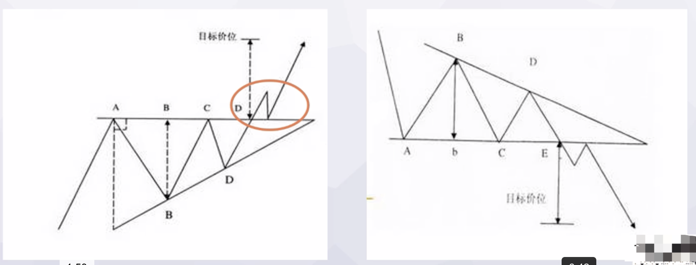 

#### 箱体
趋势线的一种特殊形态就是箱体。股价突破一边不回落至箱体内，则运行结束。

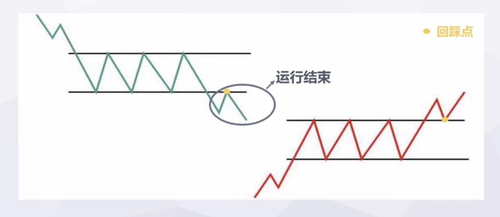 

#### 缺口理论
一般在趋势较强或者出现重大消息时，股价在开盘会有大波动，此时会形成缺口。需要结合量价分析一起看。

|类型|描述|指导意义
|-----------|:-----------------|:-----------------|
|普通型缺口 |幅度不大，多空均衡 可能会回落或者冲高回补缺口| 后续可能回补|
|突破缺口| 力量强，继续上涨或者下跌| 重大基本面变化，短时间内不会回补，顺势而为|
|衰竭缺口| 上涨或者下跌的后端|需要警惕是否反向力量即将出现|

#### 波浪理论

##### 1.波浪构造
波浪理论是20世纪30年代由艾罗特·波浪提出。
分为主要趋势：主浪【五个子浪12345】
次要趋势：调整浪【三个子浪，ABC】

波浪理论认为，市场所有的波动都是由5+3浪组成的。而每一个浪型中的子浪又能分出子浪。
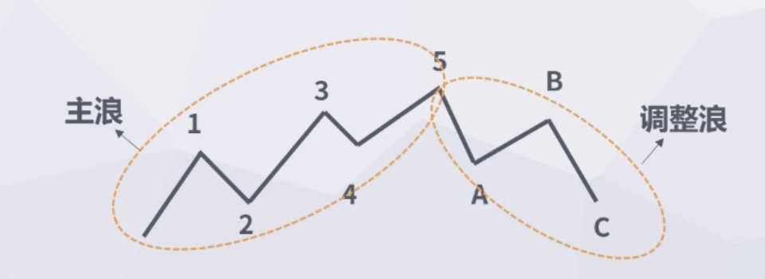 
##### 2.波浪规则

这是为了解决千人千浪的问题。
##### 1）4浪不能进入2浪
四浪的最低点不可低于二郎最高点
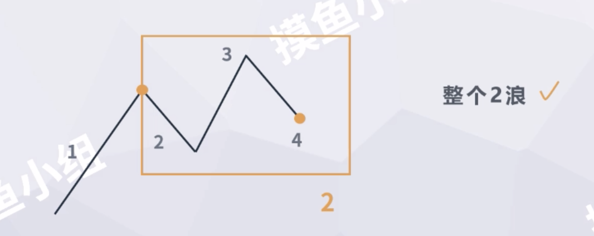  
##### 2）三浪是整个波浪中最好挣钱的浪
原因： 
1.一浪难判断，由于存在趋势反转，难以判断准确
2.二浪调整弱
3.三浪力度强

首先要数清楚2浪中的C浪是什么时候结束的。C浪的最低点不一定是二浪的最低点。

##### 3）浪形可延长，五浪难言顶
一个浪走出第五浪，如果反方力量一直不出现，那么市场会沿着当前形势继续前行。
五浪不知道何时才到顶，也正是市场的魅力所在。
因此我们要做的是，找出能 **决策** 的点。而不是任何一个时间点都进行判断。

#### 3.浪形分析
##### 形态
主浪：沿着当前趋势走，向上或向下。只需要对比135浪斜率的不同。
调整浪：
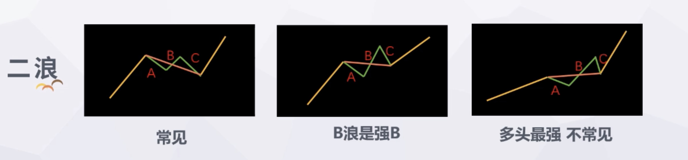 
 

##### 浪形的长度（时间维度）
* 无法确定第一浪的时间长度
* 二三四浪的时间长度与一浪相当（时间差平均不超过20%）
* 不判断五浪

原则： 多空双方出牌时间相当

多头出完空头出，如果时间太短，则空头可能还没出完；如果时间太长，空头可能已经出牌结束，多头再出。
如果从股价的角度没有看到多头出牌，而从时间的角度感受到多头出牌，则又可能趋势出现反转。

##### 浪形的宽度（空间维度）
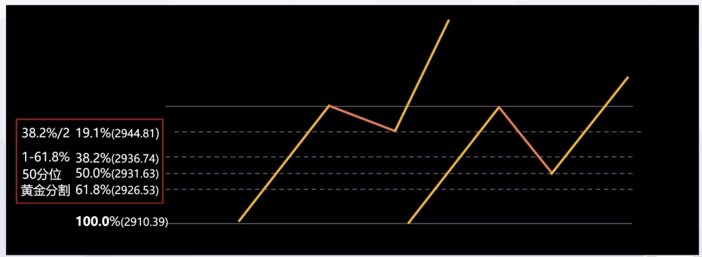 
调整幅度有多大可以通过黄金分割和50分位来提前判断。
如图所述，二浪回撤有以下几个点位的可能性，19.1%，38.2%，50%，61.8%。

* 调整浪幅度有多大？

二浪通过一浪的涨幅来判断，四浪则通过三浪的涨幅来计算。

* 三浪有多高呢？

三浪的高度在一浪的1.618至2.618倍区间内。

通过波浪理论，可以了解到接下来哪种走势最有可能，来辅助做出投资决策。

#### 技术指标

分类：趋势指标（MACD），乖离指标（KDJ），支撑压力指标（BOLL）。
每类各挑一种来做解析。

##### MACD
MACD应用了移动平均线的原理，通过计算得出。
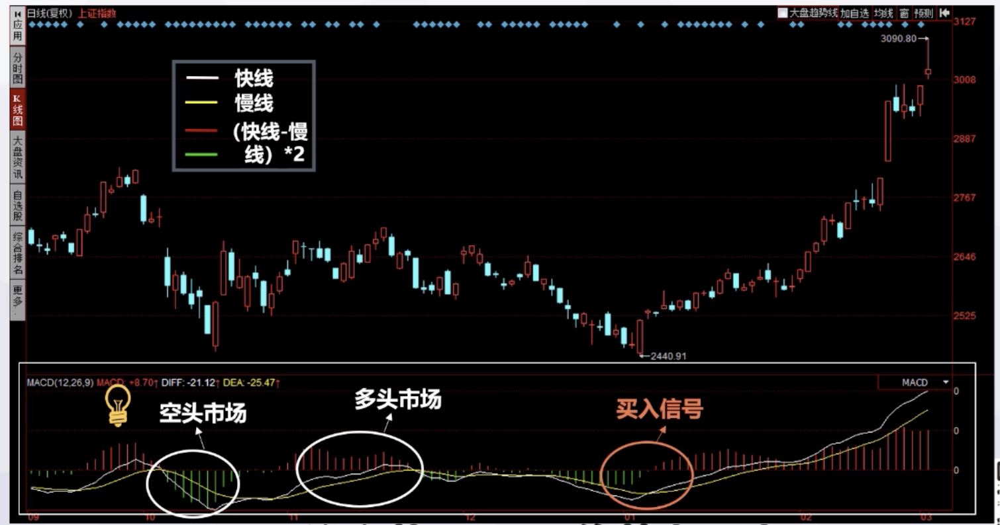 
黄线代表快线，蓝线代表缦线，红色柱子和绿色柱子代表（快线-慢线）*2

一般认为柱子呈现红色，处于多头市场；柱子呈现绿色则反之。颜色反转处则认为是买入/卖出信号。

当两根线都处于0轴以上，则认为绿柱是调整；
当两根线都处于0轴以下，则认为红柱为反弹。

* 背离

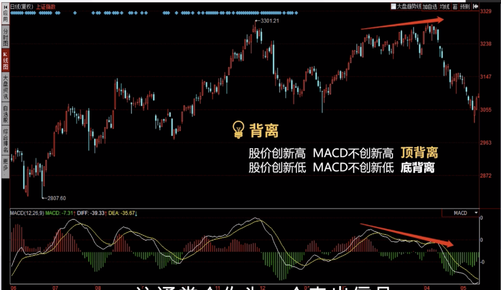 
股价和MACD出现相反走势则称之为背离。
如果股价创新高，而MACD不创新高，则认为是顶背离，通常作为卖出信号；
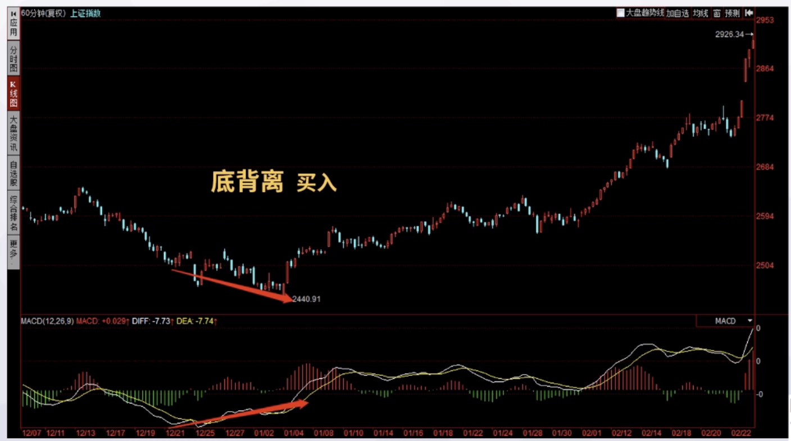 
如果股价创新低，MACD不创新低，则认为是底背离。通常是一个买入信号。
这就意味着趋势可能发生改变。

##### KDJ
n(9)日RSV = (Cn - Ln) / (Hn - Ln) * 100
Cn为第n日收盘价，Ln为n日内最低价，Hn为n日内最高价
K值 = 2/3 * 前一日K值+ 1/3 * 当日RSV
D值 = 2/3 * 前一日D值+ 1/3 * 当日K值
J值 = 3 * 当日K值 - 2 * 当日D值
无值，K，D则用50代替。

用来判断是否出现超买超卖。
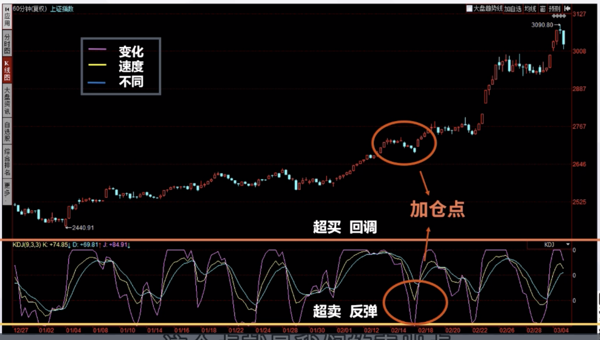 
三者线的区别子在于变化速度不同。
当触及100的上限，则认为是超买，有可能回调；
当触及-100的下限，则认为是超卖，有可能会反弹。
这个指标更适合帮助我们判断回调和反弹结束，用来加仓或者减仓。

##### BOLL
布林线又称为布林轨，由三根线组成。
中间的线称之为中轨线，是N日的移动平均线。
上轨线 = 中轨线 + 两倍的标准差
下轨线 = 中轨线 + 两倍的标准差
一般这个N是20。

是一个分布概率的指标，可以大概确定支撑压力。接近上轨卖出，接近下轨买入。
用来指导我们适当加仓和减仓。
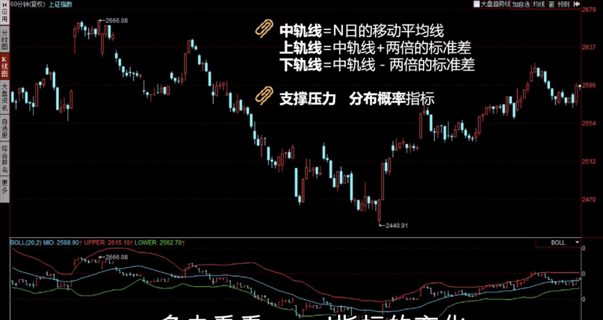 

上述三种指标中，MACD比较重要，有重要的指导意义，需要在实战中经常使用。

#### 看盘
主要讲看盘看什么，怎么看。

##### 软件
行情软件： 同花顺，通达信，东方财富，Wind等；
新闻软件：Wind， 财联社等，提供24小时新闻滚动；

越早了解到一些投资信息，交易越有优势。

##### 编排操作页面
一般关注板块涨幅排序，关注股票的移动，全市场短线的涨跌；

##### 看个股盘口成交
主要应用于短线投资。

* 如何在上冲下冲结束后，以比较精准的价位买入或者卖出呢？

委买委卖的差额，就可以用来判断这个指标。
负值是卖盘大于买盘，比较常见，一般来说，总委卖是总委买的两倍左右。
需要观察差额反向波动，当差额反向波动大时，需要立刻做出买卖操作。

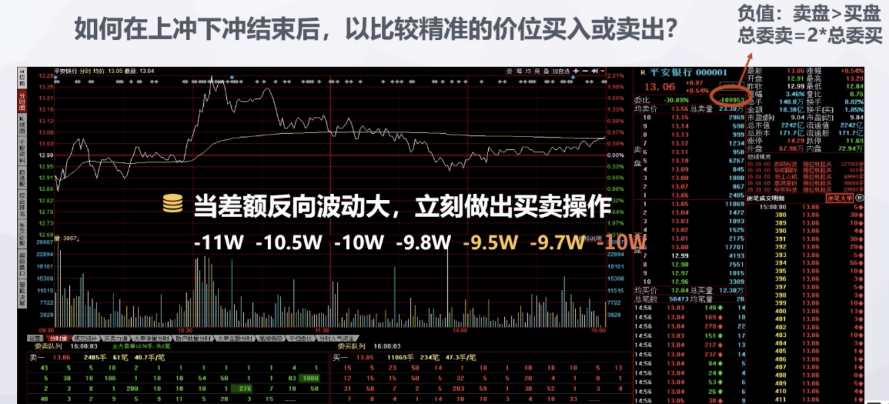

当股价上涨或下跌到证书关口时，往往会有压力或者支撑。
也要注意指数的假突破。要看买盘和卖盘是否可以顺利接上。

##### 看大盘

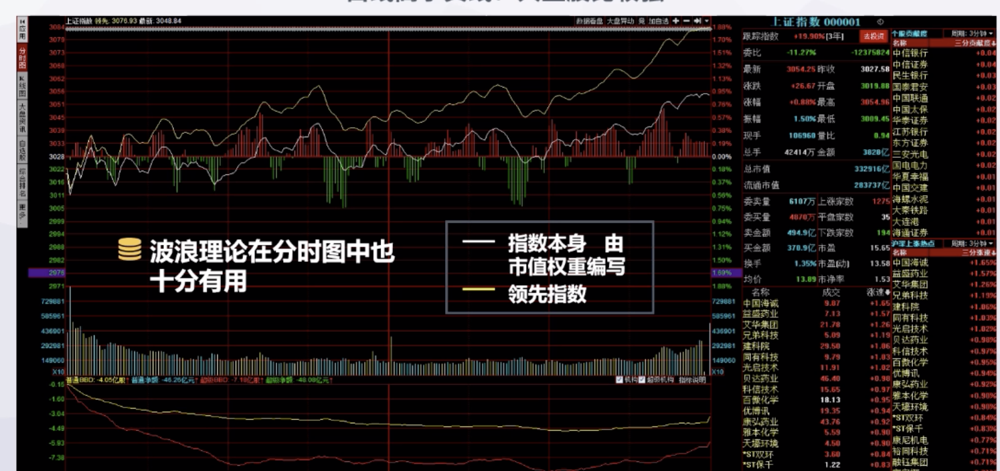
当黄线高于白线，则小盘股比较强，投资者总体偏爱小盘股，说明市场氛围好；
当白线高于黄线，则大盘股比较强。

