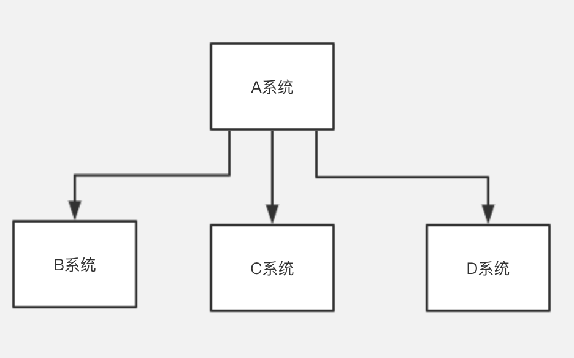
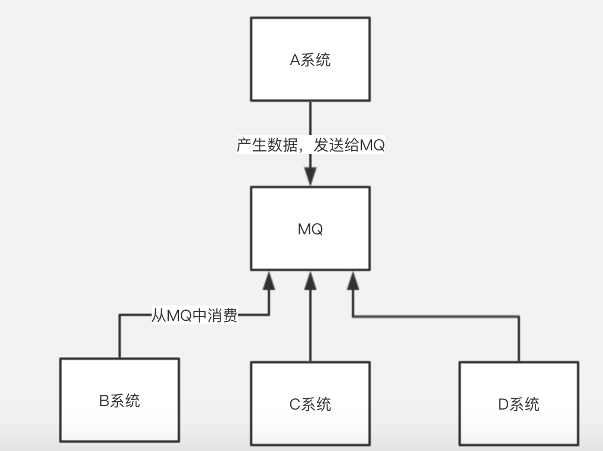
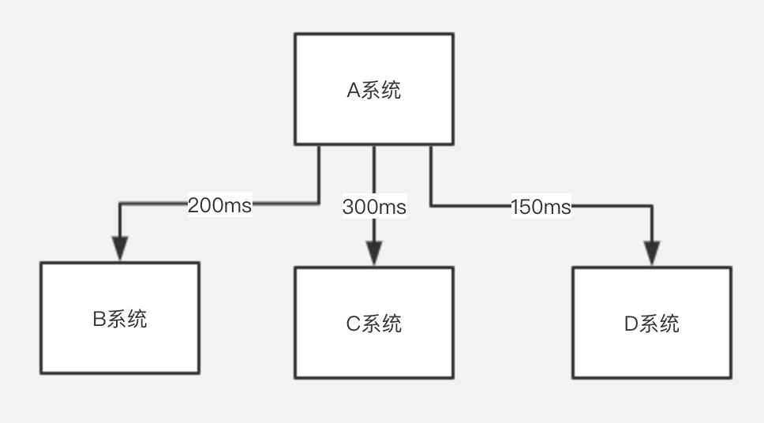
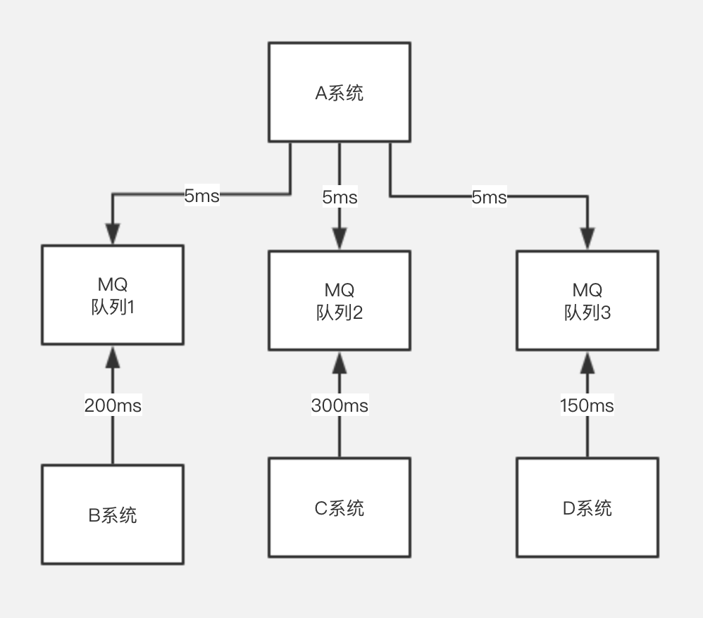

### 什么是消息队列？

消息队列，也就是所谓的MQ（Message Queue）。消息队列可以简单理解为：把要传输的数据放在队列中。
<!-- more -->
### 使用消息队列可以解决什么问题？

#### 1.解耦

如果在原有系统架构中，需要额外增加一个系统E或者删除一个系统C，也需要对A系统进行修改。A 系统跟其它各种乱七八糟的系统严重耦合，A系统产生一条比较关键的数据，很多系统都需要 A系统将这个数据发送过来。A 系统要时时刻刻考虑BCD三个系统如果挂了该咋办？要不要重发，要不要把消息存起来？

而在增加MQ之后，我们将A系统与BCD系统进行了解耦，A系统只管往MQ中放消息，BCD从消息队列中取消息进行处理。这样下来，A 系统不需要去考虑要给谁发送数据，不需要维护这个代码，也不需要考虑人家是否调用成功、失败超时等情况。通过一个 MQ，Pub/Sub 发布订阅消息这么一个模型，A 系统就跟其它系统彻底解耦了。

#### 2.异步

再来看一个场景，A 系统接收一个请求，需要在自己本地写库，还需要在 BCD 三个系统写库，自己本地写库要 3ms，BCD 三个系统分别写库要 300ms、150ms、200ms。最终请求总延时是 3 + 300 + 150 + 200 = 653ms，用户通过浏览器发起请求等待时间这几乎是不可接受的。

再通过MQ之后，那么 A系统连续发送3条消息到 MQ 队列中，假如耗时15ms，A 系统从接受一个请求到返回响应给用户，总时长是 3 + 15 = 8ms，对于用户而言，其实感觉上就是点个按钮，18ms 以后就直接返回了，用户体验就非常的好。

#### 3.削峰
用户请求量不是恒定的数值，总会有峰谷的变化。比如高峰期时，大量的请求直接到后台的话，可能直接就把系统给请求崩溃了，从而用户也没法继续使用这个系统。但是高峰期一过，又恢复如初。

在有MQ的情况，短暂的高峰请求就会积压在MQ中，等到高峰期一过，请求也会依次得到处理。从而解决高峰期访问量飙升的问题。

### MQ有哪些问题？

- 系统可用性降低 
系统引入的外部依赖越多，越容易挂掉。如果MQ挂掉，则会导致ABCD四个系统全部崩溃。那么就要需要保证MA的高可用。

- 系统复杂度提高 
增加MQ之后，如何保证消息没有重复消费？如何处理消息丢失呢？怎样保证消息传递的顺序？

- 一致性问题 
A系统处理完了直接返回了成功，都以为这个请求成功了。但是在BCD这边，如果BC处理成功了，D写库失败了，如何处理？

- 消费者怎么从消息队列里边得到数据 
生产者将数据放到消息队列中，消息队列有数据了，主动叫消费者去拿(俗称push)
消费者不断去轮训消息队列，看看有没有新的数据，如果有就消费(俗称pull)

所以，引入MQ有很多好处，也增加了系统的复杂性。

### Kafka、ActiveMQ、RabbitMQ、RocketMQ 有什么优缺点？

| 特性 | ActiveMQ | RabbitMQ | RocketMQ | Kafka |
|---|---|---|---|---|
| 单机吞吐量 | 万级，比 RocketMQ、Kafka 低一个数量级 | 同 ActiveMQ | 10 万级，支撑高吞吐 | 10 万级，高吞吐，一般配合大数据类的系统来进行实时数据计算、日志采集等场景 |
| topic 数量对吞吐量的影响 | | | topic 可以达到几百/几千的级别，吞吐量会有较小幅度的下降，这是 RocketMQ 的一大优势，在同等机器下，可以支撑大量的 topic | topic 从几十到几百个时候，吞吐量会大幅度下降，在同等机器下，Kafka 尽量保证 topic 数量不要过多，如果要支撑大规模的 topic，需要增加更多的机器资源 |
| 时效性 | ms 级 | 微秒级，这是 RabbitMQ 的一大特点，延迟最低 | ms 级 | 延迟在 ms 级以内 |
| 可用性 | 高，基于主从架构实现高可用 | 同 ActiveMQ | 非常高，分布式架构 | 非常高，分布式，一个数据多个副本，少数机器宕机，不会丢失数据，不会导致不可用 |
| 消息可靠性 | 有较低的概率丢失数据 | 基本不丢 | 经过参数优化配置，可以做到 0 丢失 | 同 RocketMQ |
| 功能支持 | MQ 领域的功能极其完备 | 基于 erlang 开发，并发能力很强，性能极好，延时很低 | MQ 功能较为完善，还是分布式的，扩展性好 | 功能较为简单，主要支持简单的 MQ 功能，在大数据领域的实时计算以及日志采集被大规模使用 |

综上，各种对比之后，有如下建议：

一般的业务系统要引入 MQ，最早大家都用 ActiveMQ，但是现在确实大家用的不多了，没经过大规模吞吐量场景的验证，社区也不是很活跃，所以大家还是算了吧，我个人不推荐用这个了；

后来大家开始用 RabbitMQ，但是确实 erlang 语言阻止了大量的 Java 工程师去深入研究和掌控它，对公司而言，几乎处于不可控的状态，但是确实人家是开源的，比较稳定的支持，活跃度也高；

不过现在确实越来越多的公司会去用 RocketMQ，确实很不错，毕竟是阿里出品，但社区可能有突然黄掉的风险（目前 RocketMQ 已捐给 [Apache](https://github.com/apache/rocketmq)，但 GitHub 上的活跃度其实不算高）对自己公司技术实力有绝对自信的，推荐用 RocketMQ，否则回去老老实实用 RabbitMQ 吧，人家有活跃的开源社区，绝对不会黄。

所以**中小型公司**，技术实力较为一般，技术挑战不是特别高，用 RabbitMQ 是不错的选择；**大型公司**，基础架构研发实力较强，用 RocketMQ 是很好的选择。

如果是**大数据领域**的实时计算、日志采集等场景，用 Kafka 是业内标准的，绝对没问题，社区活跃度很高，绝对不会黄，何况几乎是全世界这个领域的事实性规范。

--------

**参考资料**：
[面试官问你什么是消息队列？把这篇甩给他！](http://developer.51cto.com/art/201904/595020.htm)
[为什么使用消息队列？消息队列有什么优点和缺点？Kafka、ActiveMQ、RabbitMQ、RocketMQ 都有什么优点和缺点？](https://doocs.github.io/advanced-java/#/docs/high-concurrency/why-mq)